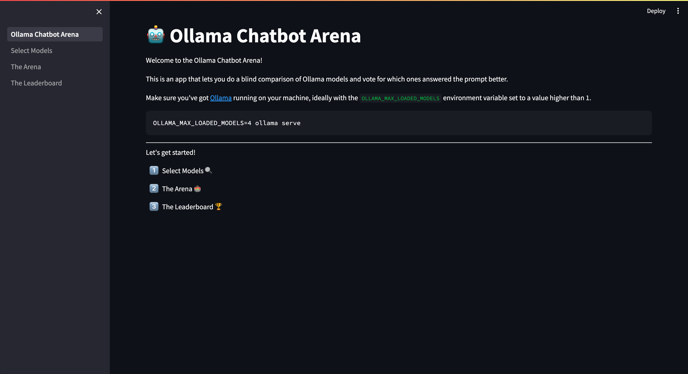

= Ollama Chatbot Arena

This is an app that lets you do a blind comparison of https://ollama.com[Ollama models^] and vote for which ones answered the prompt better.
It's inspired by the https://lmsys.org/blog/2023-05-03-arena/[LMSYS Chatbot Arena^]  that lets you do the same thing for a whole variety of hosted models.

== Pre-requisites

Make sure that Ollama is running and that it can load multiple models at the same time.
You can do this by running the following command:

[source, bash]
----
OLLAMA_MAX_LOADED_MODELS=4 ollama serve
----

== How do I run the app?

Clone the repository:

[source, bash]
----
git clone git@github.com:mneedham/chatbot-arena.git
cd chatbot-arena
----

And then run it using Poetry:

[source, bash]
----
poetry run streamlit run Ollama_Chatbot_Arena.py --server.headless True
----

Navigate to http://localhost:8501 and you should see the following:

